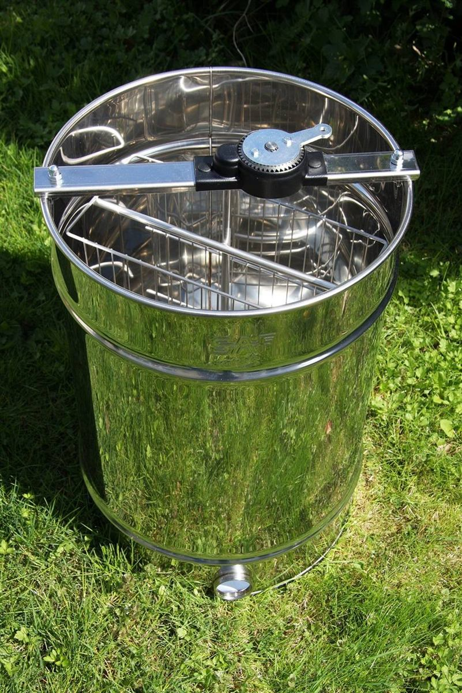
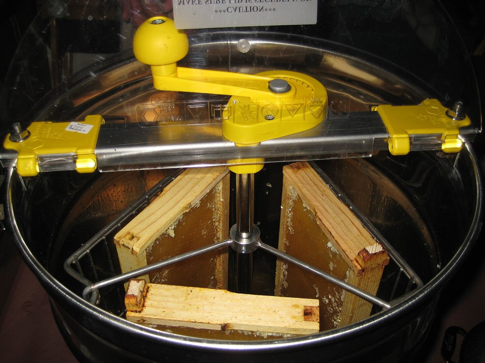
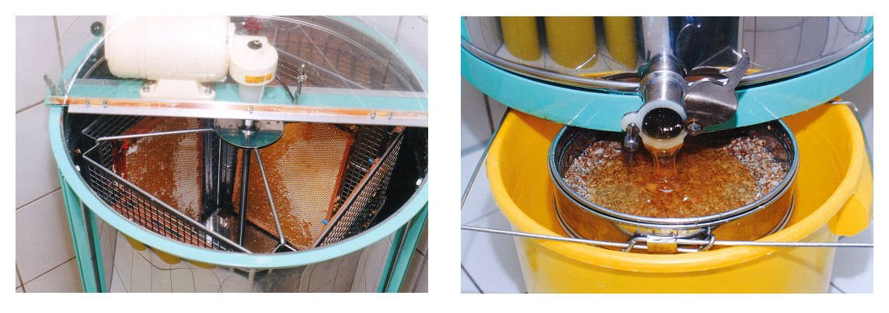

# Honigschleudern für Dadant Blatt

## Inhaltsverzeichnis

1. [Anforderungen](#anforderungen)
2. [Schleudertypen](#schleudertypen)
3. [Empfehlung: Logar 20/8-Waben Radialschleuder](#empfehlung-logar-208-waben-radialschleuder)
4. [Top-Modelle Vergleich](#top-modelle-vergleich)
5. [Bezugsquellen Schweiz](#bezugsquellen-schweiz)
6. [Entscheidung](#entscheidung)

---

## Anforderungen

- **Beutensystem:** Dadant Blatt mit Halbrahmen (435 x 159mm) für Honig
- **Brutwaben:** 435 x 300mm (gelegentlich schleudern)
- **Völkeranzahl:** 4-5 (ab 2036: max. 8)
- **Antrieb:** NUR motorisiert
- **Standort:** Arosa 1570m → Transport/Gewicht wichtig!

*Radialschleuder mit offenem Deckel. Entscheidend beim Kauf ist genau das hier Sichtbare: Der Korb muss die Wabenlänge aufnehmen — Dadant-Rahmen sind mit 435 mm deutlich breiter als Zander, und ein zu kleiner Korb macht die Schleuder für dieses Format unbrauchbar. Foto: CC BY, via Wikimedia Commons.*

## Schleudertypen

*Ein beladener Radialkorb von oben: Die Waben stehen wie Speichen, die Zellöffnungen nach aussen. Genau diese Anordnung erlaubt es, beide Wabenseiten gleichzeitig zu schleudern — der Grund, warum die Radialschleuder für Halbrahmen empfohlen wird. Foto: Nancy McClure, CC BY 2.0, via Wikimedia Commons.*

### Radialschleuder (EMPFOHLEN für Halbrahmen)

*Dieselbe Schleuder zweimal: links der Korb im Kessel, rechts der Honig, der sich am Boden sammelt und zum Auslauf fliesst. Der Kesselboden ist deshalb konisch — was nicht abläuft, muss später von Hand herausgeholt werden. Foto: Axel Hindemith, Public Domain, via Wikimedia Commons.*

Waben stehen wie Speichen eines Rades. Beide Seiten werden gleichzeitig geschleudert.

**Vorteile:**
- Kein Wenden nötig → grosse Zeitersparnis
- Hohe Kapazität: 12-28 Halbrahmen in einem Durchgang
- Ideal für niedrige Rahmen wie Dadant Halbrahmen (159mm)
- Geringer Wabenbruch bei kleinen Rahmen

**Nachteile:**
- Bei grossen Brutwaben (300mm) eher Bruchgefahr
- Grösserer Kessel nötig

### Selbstwendeschleuder

Tangential mit automatischem Wenden (180°). Ideal für grosse Waben.

**Vorteile:** Kein Wabenbruch, auch für Brutwaben perfekt, Vollautomatik
**Nachteile:** Ab EUR 2'500+, schwer (65-80kg), für reine Halbrahmen "Overkill"

### Tangentialschleuder (nicht empfohlen)

Waben parallel zur Wand, manuelles Wenden nötig. Zu wenig Kapazität für 4-8 Völker.

---

## Empfehlung: Logar 20/8-Waben Radialschleuder

### Begründung

1. **20 Halbrahmen** auf einmal → bei 4-5 Völkern reicht ein Durchgang
2. **39 kg** → eine Person kann sie tragen (wichtig für Arosa!)
3. **63cm Durchmesser** → passt durch jede Tür und in jeden PKW
4. **Vielseitig:** 4 Einhängegitter für Brutwaben inklusive
5. **Qualität:** Edelstahl AISI 304, 0.8/1.0mm Wandstärke
6. **Preis:** EUR 1'570 (ca. CHF 1'550)

---

## Top-Modelle Vergleich

### 1. Logar 20/8 Radial Motor (Art. 4557) — EMPFEHLUNG

| Merkmal | Spezifikation |
|---------|---------------|
| **Kapazität** | 20 Halbrahmen ODER 8 Ganzwaben ODER 4 Brutwaben (tangential) |
| **Motor** | 110W / 230V, Groschopp-Qualitätsmotor |
| **Material** | Edelstahl AISI 304, 0.8/1.0mm |
| **Kessel** | Ø 63cm (innen), Höhe 111cm |
| **Gewicht** | 39 kg |
| **Preis** | EUR 1'570 (ca. CHF 1'550) |
| **Kaufen** | [honigschleudern.eu](https://www.honigschleudern.eu) |

**+ Vorteile:** Beste Preis-Leistung, leicht, vielseitig, Qualitätsmotor
**- Nachteile:** Einfacher Motorantrieb ohne Programmautomatik

---

### 2. Logar 20/8 Vollelektronisch (Art. 4555)

| Merkmal | Spezifikation |
|---------|---------------|
| **Kapazität** | 20 Halbrahmen / 8 Ganzwaben / 4 Brutwaben |
| **Motor** | 110W / 230V, Frequenzumrichter, 8 Programme |
| **Material** | Edelstahl AISI 304 |
| **Kessel** | Ø 63cm, 111cm Höhe |
| **Gewicht** | 39 kg |
| **Preis** | EUR 2'263 (ca. CHF 2'200) |
| **Kaufen** | [honigschleudern.eu](https://www.honigschleudern.eu) |

**+ Vorteile:** Vollautomatik, extra leise (Frequenzumrichter), programmierbar
**- Nachteile:** EUR 700 teurer als einfacher Motor

---

### 3. Lega TUCANO 20 Dadant (GAMMA) — Schweizer Bezug

| Merkmal | Spezifikation |
|---------|---------------|
| **Kapazität** | 20 Dadant Halbrahmen |
| **Motor** | GAMMA 2 Unterantrieb, 0-460 U/min |
| **Material** | Edelstahl AISI 304, WIG-geschweisst |
| **Kessel** | Ø 63cm |
| **Preis** | CHF 1'800 (apimat.ch) |
| **Kaufen** | [apimat.ch](https://apimat.ch) |

**+ Vorteile:** Schweizer Händler (kein Zoll!), Unterantrieb (freie Beladung oben)
**- Nachteile:** Etwas teurer als Direktimport Logar

---

### 4. CFM 18-Halbwaben Flüsterhexe (Art. 5263018)

| Merkmal | Spezifikation |
|---------|---------------|
| **Kapazität** | 18 Halbrahmen (bis 16cm) |
| **Motor** | 40W / 230V, Direktantrieb, stufenlos 80-350 U/min |
| **Material** | Edelstahl, spaltfrei verschweisst |
| **Kessel** | Ø 63cm, 100cm Beladehöhe |
| **Gewicht** | ~35 kg |
| **Preis** | EUR 1'834 |
| **Kaufen** | [carl-fritz.de](https://www.carl-fritz.de/CFM-Radialschleuder-OE-63cm-18-Halbwaben-mit-Fluesterhexe/5263018) |

**+ Vorteile:** Extrem leise (!), Made in Germany, Top-Qualität
**- Nachteile:** "Nur" 18 Halbrahmen, kein Programmautomat

---

### 5. Lega FLAMINGO 28 Dadant (apimat.ch)

| Merkmal | Spezifikation |
|---------|---------------|
| **Kapazität** | 28 Dadant Halbrahmen (!!) |
| **Motor** | GAMMA Unterantrieb, 0-460 U/min |
| **Material** | Edelstahl AISI 304 |
| **Kessel** | ~Ø 76cm |
| **Gewicht** | ~45 kg |
| **Preis** | CHF 1'900 (GAMMA, apimat.ch) |
| **Kaufen** | [apimat.ch](https://apimat.ch) |

**+ Vorteile:** 28 Halbrahmen = gesamte Ernte von 8 Völkern in EINEM Durchgang!
**- Nachteile:** Grösserer Kessel, schwerer, evtl. überdimensioniert anfangs

---

### 6. Lyson Optima 20 Radial (600mm) — Budget

| Merkmal | Spezifikation |
|---------|---------------|
| **Kapazität** | 12-20 Halbrahmen (je nach Höhe) |
| **Motor** | 24V / 250W, Programmautomatik |
| **Material** | Edelstahl 0.6mm |
| **Kessel** | Ø 60cm |
| **Gewicht** | 60 kg |
| **Preis** | EUR 956 |
| **Kaufen** | [imkerei-seiringer.com](https://www.imkerei-seiringer.com) |

**+ Vorteile:** Günstigster Preis, Programmautomatik inklusive
**- Nachteile:** Dünnere Wand (0.6mm), 60 kg schwer (!), Qualität unter Logar/CFM

---

## Bezugsquellen Schweiz

| Händler | Website | Spezialität |
|---------|---------|-------------|
| APIMAT | [apimat.ch](https://apimat.ch) | Lega-Vertrieb, grosse Auswahl |
| Bienen Meier AG | [bienen-meier.ch](https://www.bienen-meier.ch) | Schweizer Traditionshaus |
| Imkereibedarf Wespi | [wespi-imkerei.ch](https://www.wespi-imkerei.ch) | Lega-Schleudern |
| Bienenbeuten.ch | [bienenbeuten.ch](https://www.bienenbeuten.ch) | RuBee-Marke |
| Logar Direktshop | [honigschleudern.eu](https://www.honigschleudern.eu) | Direkt aus Slowenien |
| Carl Fritz (CFM) | [carl-fritz.de](https://www.carl-fritz.de) | Made in Germany |

## Entscheidung

**Logar 20/8-Waben Radialschleuder mit Motor** (EUR 1'570 / ~CHF 1'550)

- Perfekte Kapazität für 4-8 Völker mit Dadant Halbrahmen
- 39 kg = transportabel für Bergstandort
- Qualitätsmotor, Edelstahl AISI 304
- Auch für Brutwaben nutzbar (4 Einhängegitter inkl.)
- Bestellbar bei honigschleudern.eu (Lieferung CH möglich)

**Alternative bei Schweizer Bezug:** Lega TUCANO 20 Dadant via apimat.ch (CHF 1'800)
