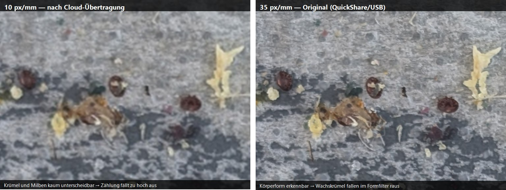
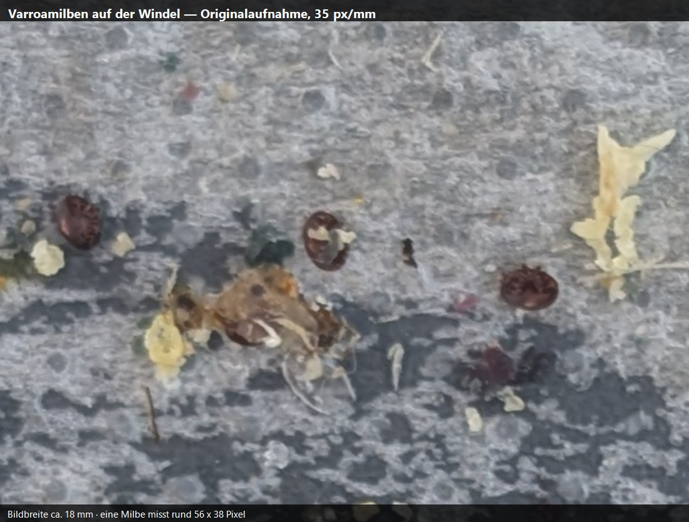
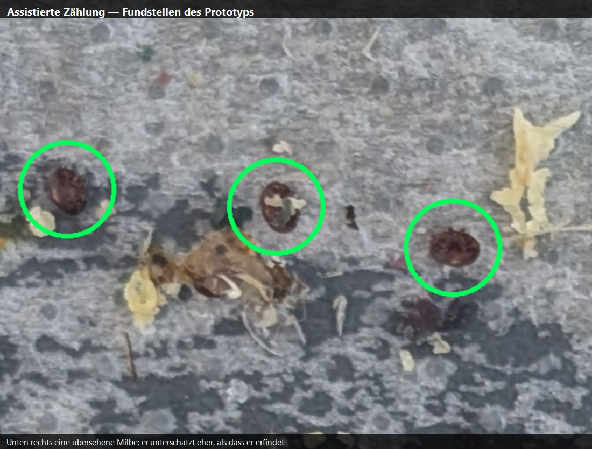
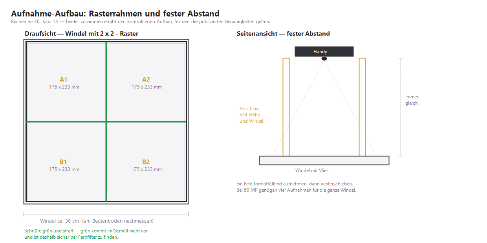

# Varroa-Zählung per Foto — Forschungsstand, verfügbare Lösungen, realistischer Weg

> Schiene: Imkerei · Stand: 2026-07-27 (inkl. eigener Messungen, Kap. 12–13) · Zweck: Belastbare Grundlage für den App-Wunsch „Gemüllkontrolle mit Fotoupload, die Varroamilben selbständig zählt und das Gemüll analysiert". Sagt, was die Forschung wirklich hergibt, welche Produkte existieren (und warum keines direkt nutzbar ist), wo die Lizenzfallen liegen, und welcher Weg mit **einem** Volk und **einer** Windel tatsächlich funktioniert — **Stufe 0 ist am 27.07.2026 an eigenen Aufnahmen durchgeführt und ausgewertet worden.**

Dieses Dokument ergänzt die Gemülldiagnose aus [15_Varroa_Bekaempfungskonzept_alpin.md](15_Varroa_Bekaempfungskonzept_alpin.md) (Kap. 3.1 Methodik, Kap. 4 Schadschwellen) und das offizielle BGD-Konzept in [22_Varroa_Behandlungskonzept_BGD.md](22_Varroa_Behandlungskonzept_BGD.md) um die **technische** Frage: Kann ein Foto die Zählung übernehmen? Die fachlichen Schwellen bleiben unverändert — sie werden hier nur als Maßstab benutzt, an dem die Messgenauigkeit gemessen werden muss.

**Kurzfassung für die Eile:** Ja, die Technik existiert und ist gut belegt (mAP bis 0,956). Nein, keine fertige Lösung ist für unsere App nutzbar — die beste steht unter einer Lizenz, die eine vermarktbare Web-App ausschließt. Der saubere Weg beginnt bei einem **frei lizenzierten spanischen Datensatz samt trainierten Modellen** und bei einem **Aufnahme-Aufbau für zwanzig Franken** (Raster + fixer Abstand, Kap. 13), der mehr bringt als jeder Modellierungstrick. Der Bereich, in dem die Automatik am zuverlässigsten ist, ist genau der Bereich, in dem unsere Behandlungsentscheidung fällt.

**Und das Wichtigste aus der eigenen Messung (Kap. 12):** Unser Handy reicht aus — die **Originalaufnahmen erreichen 35 px/mm**, exakt den Wert der Referenzstudie. Entscheidend ist nicht die Kamera, sondern der **Übertragungsweg**: Cloud und Messenger rechnen 50 MP auf 4 MP herunter. Und eine zu niedrig aufgelöste Aufnahme liefert nicht bloß eine ungenauere Zahl, sondern eine **systematisch zu hohe** — bei 10 px/mm zählte derselbe Detektor 115, bei 35 px/mm nur 69, und erst die 69 hielten dem Augenschein stand.

---

## Inhaltsverzeichnis

1. [Die Fragestellung — und was daran technisch schwer ist](#1-die-fragestellung--und-was-daran-technisch-schwer-ist)
2. [Forschungsstand: was nachweislich funktioniert](#2-forschungsstand-was-nachweislich-funktioniert)
3. [Die Fehler-Asymmetrie — der wichtigste Praxisbefund](#3-die-fehler-asymmetrie--der-wichtigste-praxisbefund)
4. [Verfügbare Produkte und Apps — ein Feld voller Ruinen](#4-verfügbare-produkte-und-apps--ein-feld-voller-ruinen)
5. [Die Lizenzfalle: warum die beste Lösung unbrauchbar ist](#5-die-lizenzfalle-warum-die-beste-lösung-unbrauchbar-ist)
6. [Datensätze — es gibt genau einen richtigen](#6-datensätze--es-gibt-genau-einen-richtigen)
7. [Pixel pro Millimeter — die Metrik, die alles entscheidet](#7-pixel-pro-millimeter--die-metrik-die-alles-entscheidet)
8. [Lernen mit wenigen Daten — was wirklich hilft](#8-lernen-mit-wenigen-daten--was-wirklich-hilft)
9. [„Die App soll lernen" — richtig und falsch umgesetzt](#9-die-app-soll-lernen--richtig-und-falsch-umgesetzt)
10. [Gemüll-Analyse — Forschungslücke, aber fachlich wertvoll](#10-gemüll-analyse--forschungslücke-aber-fachlich-wertvoll)
11. [Der empfohlene Weg in vier Stufen](#11-der-empfohlene-weg-in-vier-stufen)
12. [Stufe 0 durchgeführt — eigene Messungen vom 27.07.2026](#12-stufe-0-durchgeführt--eigene-messungen-vom-27072026)
13. [Der Aufnahme-Aufbau: Raster + fixer Abstand](#13-der-aufnahme-aufbau-raster--fixer-abstand)
14. [Was zu vermeiden ist](#14-was-zu-vermeiden-ist)
15. [App-Relevanz](#15-app-relevanz)
16. [Offene Punkte](#16-offene-punkte)
17. [Cross-Referenzen](#17-cross-referenzen)
18. [Quellen](#18-quellen)

---

## 1. Die Fragestellung — und was daran technisch schwer ist

Der Wunsch besteht aus zwei sehr unterschiedlich schweren Teilen:

- **Teil A — Milben zählen:** Auf der Windel liegende Varroamilben auf einem Foto finden und zählen. Gut erforscht, mehrere funktionierende Systeme, klare Kennzahlen.
- **Teil B — Gemüll analysieren:** Die Zusammensetzung des Gemülls beurteilen (Wachsdeckel, Pollen, Zuckerkristalle, Bienenteile, Wachsmottengespinst, Schimmel). **Dazu existiert keine Forschung** — siehe Kap. 10.

Teil A ist deshalb schwer, weil eine Varroamilbe **1,6 × 1,1 mm** groß ist und auf einer Dadant-Windel von grob 43 × 57 cm liegt. Das Objekt bedeckt also rund ein Hunderttausendstel der Bildfläche. In der Fachsprache der Bildverarbeitung ist das ein „small object detection"-Problem im Extrembereich — und dazu ein Zählproblem, was nicht dasselbe ist wie ein Erkennungsproblem: Eine doppelt gezählte Milbe ist ein direkter Fehler im Wert „Milbenfall pro Tag", auf dem die Behandlungsentscheidung beruht.

Zwei Eigenschaften unserer Windel verschärfen die Lage, zwei erleichtern sie:

**Erschwerend:** Die Windel ist **eingeölt/eingefettet** (Kap. 3.1 in Recherche 15) → Glanzlichter und Spiegelungen, die ein Modell mit Milben verwechseln kann. Und: **helle wie dunkle Milben zählen beide** — frisch gefallene sind rotbraun, älter/abgestorbene können ausgeblichen sein. Ein naiver Rotbraun-Filter fällt also aus.

**Erleichternd:** Die Windel ist eine **weiße Platte mit Raster**. Der Kontrast ist damit hoch, und das Raster ist ein eingebauter Maßstab — es erlaubt Perspektivkorrektur und zellenweises Zählen. Zweitens liegen Milben auf der Windel **separiert**, sie überlappen sich praktisch nie. Das ist für die Bildauswertung eine erhebliche Vereinfachung (und für die Augmentation in Kap. 8 sogar ein Geschenk).

---

## 2. Forschungsstand: was nachweislich funktioniert

Vier Arbeiten tragen den Stand der Technik. Zwei stammen von derselben spanischen Gruppe (Universidad de La Rioja / Zaragoza) und bauen aufeinander auf — deren Weg ist für uns der lehrreichste, weil sie ihre eigenen Entscheidungen ein Jahr später teilweise revidiert haben.

### 2.1 Sensors 2024 — Faster R-CNN, und der Kachel-Refinement-Trick

Die erste Arbeit erreichte **mAP@0,5 = 0,9073** bei **mAR₁₀₀ = 0,967** — mit lediglich **50 Trainingsbildern** und 580 annotierten Milben. Die 48-Megapixel-Bilder wurden in 224 × 224-Kacheln zerlegt (972 Kacheln pro Bild → 62'208 Trainings-Patches).

Der lehrreichste Einzelbefund ist die Ablation:

| Konfiguration | mAP@0,5 |
|---|---|
| ohne alles | 0,777 |
| nur DeblurGAN (Schärfe-Rekonstruktion) | 0,780 (+0,003) |
| **nur Refinement-Step** | **0,858 (+0,081)** |
| beides | **0,907** |

Der **Refinement-Step** war also der weitaus größte Gewinn — und er löst genau das Zählproblem: Liegt eine Milbe auf einer Kachelgrenze, wird sie in jeder angrenzenden Kachel einmal erkannt. Der Schritt baut für jede Randdetektion eine **neue, auf die Box zentrierte Kachel** und sagt dort neu vorher; zusammengeführt wird, wenn die Schnittfläche mindestens die halbe Fläche der ursprünglichen Vorhersage ausmacht. Ohne diesen Schritt zählt das System Randmilben doppelt.

### 2.2 Agriculture 2025 — VarroDetector, der aktuelle Referenzstand

Die Nachfolgearbeit derselben Gruppe wechselte auf **YOLOv11-Nano** und erreichte **Precision 0,925 · Recall 0,921 · mAP 0,956**, bei einer Korrelation zur manuellen Zählung von **R² = 0,978 bis 0,991** über drei verschiedene Smartphones. Rechenzeit ohne GPU: **24–40 Sekunden pro Blatt**.

Bemerkenswert ist, was sie dabei **verworfen** haben: Die Kachel-Technik (SAHI) wurde geprüft und nicht eingebaut — die Verbesserung sei gering gegenüber dem starken Anstieg der Inferenzzeit. Stattdessen lösten sie das Auflösungsproblem **physisch**: Netz-Eingabegröße 800 px statt der Standard-640, und **vier separate Fotos pro Einlage** (das Blatt wird mit grünen Schnüren in vier Rahmen à 23,5 × 18,5 cm geteilt, die die Software per Farbfilter und Hough-Transformation automatisch als Bildbereich erkennt). Die Vorgängerarbeit mit 12-MP-Kameras brauchte dafür noch **acht** Fotos.

Das ist die zentrale Lehre: **Nicht das Modell löst das Auflösungsproblem, sondern die Aufnahmetechnik.**

### 2.3 VarroaNet — der Gegenentwurf: klein, schnell, sparsam

Ein methodisch ganz anderer Ansatz kombiniert klassische Bildverarbeitung (Blob-Erkennung über mehrere Helligkeitsschwellen) mit einem winzigen neuronalen Netz von rund **50'000 Parametern** — gegenüber Millionen bei den Detektoren oben. Ergebnis: **F1-macro 92,1 %** bei **0,01 Sekunden auf einem einzigen CPU-Kern**.

Das ist für eine Web-App architektonisch hochinteressant. Ein wichtiger Warnbefund derselben Arbeit: Die Spezifität brach über die Jahreszeiten um **11,6 %** ein — weil sich das Gemüll saisonal völlig verändert (Wachskrümel im Frühjahr, anderes Bild bei der Einwinterung). Das ist die Drift, die uns auch treffen wird.

### 2.4 Bee Varroa Scan (BeeVS) — die beste Zählkorrelation, und die entscheidende Fehlertabelle

Das italienische System (Apisfero, peer-reviewed 2025) arbeitet mit einem Spezialscanner und **60 überlappenden Teilbildern à 50 × 70 mm** (zusammen 120 Megapixel). Es erreicht **R² = 0,998** — die beste publizierte Zählkorrelation überhaupt. Trainiert wurde mit rund 65'000 positiven und 1,2 Millionen negativen Beispielen.

Der eigentliche Wert dieser Arbeit für uns liegt aber in etwas anderem: Sie ist die einzige, die den **Zählfehler nach Milbenzahl aufgeschlüsselt** berichtet. Das ist Kapitel 3.

---

## 3. Die Fehler-Asymmetrie — der wichtigste Praxisbefund

Alle Systeme sind bei **wenigen** Milben schlecht und bei **vielen** Milben exzellent. Das klingt zunächst nach einem Nachteil, ist aber für die imkerliche Praxis der glücklichste denkbare Verlauf.

**BeeVS, Zählfehler nach Milbenzahl pro Blatt:**

| Milben/Blatt | Fehler | Bedeutung für den Entscheid |
|---|---|---|
| 0–2 | **120,69 %** | irrelevant — eindeutig „grün" |
| 3–10 | 22,36 % | Randbereich |
| **11–50** | **0,78 %** | **hier fällt der Entscheid** |
| **51–100** | **0,29 %** | **hier fällt der Entscheid** |
| > 100 | **0,00 %** | eindeutig „rot" |

**VarroDetector, Mensch gegen Automatik** (dieselbe Struktur, unabhängig bestätigt):

| Milben/Blatt | Fehler Mensch | Fehler Automatik |
|---|---|---|
| 0–10 | 32 % | **149 %** |
| 50–100 | 13 % | **2,3 %** |
| 100–200 | 10 % | **0,2 %** |

Ab etwa 50 Milben pro Blatt ist die Automatik also **verlässlicher als geschulte menschliche Zähler** — BeeVS berichtet bei N ≥ 60 eine Standardabweichung von **4,38 gegenüber 32,14** beim Menschen. Menschen ermüden, verlieren die Übersicht und zählen bei hoher Dichte systematisch zu niedrig; die Maschine nicht.

### Gegenrechnung mit unseren Schwellen

Und jetzt der Abgleich mit den Schwellen aus [15](15_Varroa_Bekaempfungskonzept_alpin.md) und [22](22_Varroa_Behandlungskonzept_BGD.md) — Juli grün < 5, gelb 5–10, rot > 10 Milben pro Tag; August < 10 / 10–25 / > 25:

Bei einer Liegezeit von 3 bis 7 Tagen liegt der **entscheidungsrelevante Bereich damit bei grob 15 bis 175 Milben pro Windel** — also exakt in den Bändern mit **0,78 %, 0,29 % und 0,00 %** Fehler. Der katastrophale 120-Prozent-Fehler tritt nur dort auf, wo das Volk ohnehin unstrittig grün ist und die Entscheidung „nicht behandeln" durch keine Fehlzählung gekippt wird.

**Zwei Konsequenzen für die Praxis:**

1. **Liegezeit gegen Genauigkeit abwägen.** 7 Tage statt 3 schieben den Zählwert in das zuverlässige Band. Recherche 15 nennt allerdings Ameisen und Wachsmotten als Gegenargument (die Milben wegtragen) und empfiehlt im Sommer eher 3 Tage — hier ist ein echter Kompromiss zu treffen, kein Rechenfehler.
2. **Die App muss ehrlich schweigen können.** Unterhalb von etwa 10 erkannten Milben sollte sie „bitte manuell nachzählen" sagen statt eine Zahl zu behaupten. Bei so wenigen Milben ist Handzählen ohnehin eine Sache von zwei Minuten.

---

## 4. Verfügbare Produkte und Apps — ein Feld voller Ruinen

Die Recherche nach fertigen Lösungen ergibt ein ernüchterndes und lehrreiches Bild: **Es gibt keine gepflegte mobile oder Web-Lösung zur Varroa-Zählung.** Mehrere gut finanzierte Versuche sind gescheitert.

| Lösung | Land | Stand 2026 | Beurteilung |
|---|---|---|---|
| **VarroDetector** | ES (EU-Horizon) | aktiv, Desktop-Software | Fachlich das Beste. **Nur Desktop**, AGPL-3.0 (Kap. 5) |
| **apiZoom** | **CH** (Agroscope-begleitet) | nach ~7 Jahren „experimentell" | Braucht **≥ 24 MP mit 1-Zoll-Sensor** — also eine echte Kamera, kein Handy. Android-App 2024 aus dem Play Store entfernt, iOS zuletzt 2021 aktualisiert. **Keine publizierte Genauigkeit** |
| **BeeScanning** | SE (918 k € EU-Förderung) | **eingestellt** (Aug. 2025) | Unabhängiger Test: Behandlungsentscheid nur in **63 %** korrekt |
| **Bee Varroa Scan** | IT (Apisfero) | Prototyp, Leihe/Nutzungsgebühr | R² 0,998, aber Scanner-Trolley, kein CH-Vertrieb |
| **VarroaCounter** | — | Dauer-Beta | — |
| **apic.ai** | DE | Varroa-Funktion stillschweigend gestrichen | — |
| **`cfconrad/varroa-count-web-app`** | Open Source | funktioniert, YOLOv8 → TensorFlow.js **im Browser** | Technisch genau unser Fall — aber GPL-3.0 **plus** Ultralytics-AGPL |
| **DACH-Einsendedienst** | — | existiert nicht | Marktlücke |

Zwei Dinge sind daran wichtig. Erstens: Die **Marktlücke ist real** — genau dort, wo unsere App ohnehin lebt (Browser, Handy-Foto). Zweitens, und das ist die unbequeme Wahrheit: **Kein einziger dieser Anbieter hat ein tragfähiges Geschäftsmodell gefunden.** Dass ein Schweizer Projekt mit Agroscope im Rücken nach sieben Jahren noch „experimentell" ist, sollte die Erwartungen ordnen.

Die ehrlichste Konkurrenzanalyse stammt aus einem Imkerforum und lautet, sinngemäß: die beste App sei eine Kopfbandlupe. Bei 60 Milben in drei Tagen ist das nicht falsch.

---

## 5. Die Lizenzfalle: warum die beste Lösung unbrauchbar ist

Das ist der Befund, der die technische Entscheidung erzwingt — und er wäre bei naivem Vorgehen erst nach der Implementierung aufgefallen.

**Ultralytics YOLO** (v5/v8/v11) steht unter **AGPL-3.0**. Das allein wäre handhabbar. Entscheidend ist die Auslegung des Herstellers: Ultralytics rechnet **auch selbst trainierte Gewichte** zum abgeleiteten Werk und verlangt eine Enterprise-Lizenz ausdrücklich für kommerzielle Produkte, geschlossene Software und für SaaS-Plattformen, die YOLO im Hintergrund nutzen — einschließlich eigens fein-abgestimmter Modelle.

Für eine Flutter-Web-App mit Supabase-Backend ist das der ungünstigste denkbare Fall: AGPL verlangt, dass **jeder Nutzer über das Netz** Anspruch auf den vollständigen Quellcode hat. Bei einer möglichen späteren Vermarktung ([roadmap-app](../../bienen_app/docs/roadmap-app.md)) ist das ein Ausschluss. Und es betrifft nicht nur VarroDetector, sondern auch die einzige existierende Browser-Umsetzung.

Dies berührt unmittelbar unsere Bildlizenz-Regel (D-65 im App-Entscheidungslog): Wir nehmen nur, was wirklich frei ist — bei Modellen und Code gilt dasselbe Prinzip wie bei Fotos.

**Lizenzsaubere Alternativen** (alle verifiziert):

| Komponente | Lizenz | Nutzbar |
|---|---|---|
| **torchvision / PyTorch** (Faster R-CNN, RetinaNet) | BSD-3-Clause | ✅ |
| **RF-DETR** N/S/M/L — Code **und** Gewichte | Apache-2.0 | ✅ |
| Detectron2 · MMDetection · YOLOX · RT-DETR · D-FINE | Apache-2.0 | ✅ |
| SAHI (Kachel-Bibliothek) | MIT | ✅ |
| SAM / SAM 2 (Segmentierung) | Apache-2.0 | ✅ |
| CVAT (Annotation) | MIT | ✅ |
| Label Studio · FiftyOne | Apache-2.0 | ✅ |
| Ultralytics YOLO **+ daraus trainierte Gewichte** | AGPL-3.0 | ❌ |
| YOLOv7 / YOLOv9 Original-Repos | GPL-3.0 | ❌ |
| YOLO-NAS-Gewichte · P2PNet | eigene, „kein kommerzieller Einsatz" | ❌ |

Der Preis dieser Sauberkeit ist gering: **mAP 0,907 statt 0,956** — und sogar diese Lücke ist mit modernen Apache-lizenzierten Architekturen (RF-DETR) wahrscheinlich schließbar.

Ein Detail noch zu Annotationswerkzeugen: Die GPL von `labelme` oder `X-AnyLabeling` betrifft die **Software**, nicht die damit erzeugten **Annotationen**. Wer ein GPL-Werkzeug nur benutzt, hat kein Copyleft-Problem an den eigenen Labels. Das unterscheidet den Fall grundlegend von Ultralytics, wo der Hersteller die **Gewichte selbst** beansprucht.

⚠️ **Und eine Falle, die leicht zu übersehen ist:** Der **Roboflow-Gratisplan** stellt Daten und Modelle öffentlich auf Roboflow Universe. Wer seine Windelfotos dort annotiert, veröffentlicht damit den eigenen Datensatz — was auch erklärt, warum dort über 300 öffentliche Varroa-Projekte liegen. Für ein Produkt, dessen einziger Vorsprung die eigenen Daten sind, wäre das der teuerste Gratisplan der Welt.

---

## 6. Datensätze — es gibt genau einen richtigen

Von über 300 auffindbaren „Varroa"-Datensätzen zeigen praktisch alle Milben **auf Bienen** (Labor-Makroaufnahmen). Das ist ein völlig anderes Bildproblem. Für Bodeneinlagen existiert **genau ein** brauchbarer öffentlicher Datensatz — und er ist frei.

**Zenodo 10231845** — *Dataset for varroa mite detection on sticky boards* (Divasón et al., Univ. La Rioja). **Lizenz CC BY 4.0** (per Zenodo-API direkt verifiziert, 2026-07-27):

| | |
|---|---|
| Bilder | **64** à **8064 × 6048 px** (48 MP), Smartphone-Aufnahmen |
| Annotation | Bounding Boxes von Fachleuten, **807 Milben** (50 Bilder/580 Training · 14/227 Validierung) |
| Bedingungen | verschiedene Smartphones, **verschiedene Lichtverhältnisse**, teils Bewegungsunschärfe, Störobjekte (Staub, Schmutz, Erde) |
| Dateien | `dataset.zip` 336 MB · `images_deblurGAN.zip` 529 MB · **`models.zip` 1032 MB** · `example.zip` 105 MB · `df_dataset.csv` |

**Der wichtigste Fund steckt in `models.zip`:** Der Record enthält die **trainierten Modelle** — und zwar Faster-R-CNN-Modelle, nicht YOLO. `example.zip` beschreibt ausdrücklich ein Modell auf Basis von Faster R-CNN mit ResNet18-Backbone und FPN. Diese Modelle stehen damit unter **CC BY 4.0** und sind kommerziell nutzbar. Das ist der einzige fertige, lizenzsaubere Varroa-Windel-Detektor, der existiert.

> **Feinheit:** Das zugehörige Code-Repository (`jodivaso/varroa_detector`) hat **keine Lizenzdatei** — der *Code* ist damit „alle Rechte vorbehalten". Nutzbar sind **Daten und Gewichte** von Zenodo; den Trainings- und Inferenz-Code schreiben wir selbst. Eine kurze schriftliche Bestätigung der Autoren wäre trotzdem billige Absicherung — sie laden im Paper ausdrücklich zur Zusammenarbeit ein.

**Ergänzende Datensätze:**

| Datensatz | Inhalt | Lizenz | Rolle |
|---|---|---|---|
| **yellow-sticky-traps** (`md-121`, verbesserte Annotationen) | 284 Bilder, **8'114 Boxen**, kleine Insekten auf Klebefläche | **CC0 (Public Domain)** | 🟢 Ideale **Zwischenstufe** für hierarchisches Transfer Learning (Kap. 8) |
| **VarroaDataset** (TU Wien, Zenodo 4085044) | 13'509 Samples mit Boxen | CC BY 4.0 | Nur als Erscheinungsbild-Vorwissen — Milben auf Bienen |
| IP102 | > 75'000 Insektenbilder | „frei für akademische Nutzung" | ❌ kommerziell nur mit Einzelerlaubnis |
| Kaggle/HuggingFace-Kopien | meist Re-Uploads | MIT/Apache/„unknown" | ❌ **Uploader-Lizenzen auf fremde Daten sind unwirksam** |

⚠️ Sieben Kaggle-/HuggingFace-Repos haben exakt dieselbe Dateigröße (1,16 GB) und deklarieren widersprüchliche Lizenzen — mit hoher Wahrscheinlichkeit alle derselbe TU-Wien-Datensatz. **Immer von Zenodo laden und korrekt zitieren.**

---

## 7. Pixel pro Millimeter — die Metrik, die alles entscheidet

Das ist die Zahl, an der alles hängt, und sie wird in der Diskussion um „welches Handy" fast immer übersehen. Nicht die Megapixel entscheiden, sondern **wie viele Pixel auf einen Millimeter Windel fallen**.

Referenz aus der Forschung: Rahmen von 23,5 × 18,5 cm auf 8064 × 6048 px ergibt **≈ 34 px/mm**. Eine Milbe (1,6 × 1,1 mm) ist dort **55 × 38 px** groß — komfortabel erkennbar.

**Eigene Rechnung für unsere Dadant-Windel** (Beute 45,5 × 60 cm → Windel grob 43 × 57 cm ≈ 2450 cm²):

| Aufnahmeart | px/mm | Milbe | Urteil |
|---|---|---|---|
| Wie im Paper (Teilrahmen, 48 MP) | ~34 | 55 × 38 px | ✅ belegt |
| **Ganze Windel in einem 48-MP-Foto** | ~14 | 23 × 16 px | ⚠️ grenzwertig |
| Ganze Windel, 200-MP-Handy | ~29 | 46 × 31 px | ✅ |
| **Windel in 6 Teilfotos à 48 MP** | ~34 | 55 × 38 px | ✅ empfohlen |

Bei der Pixeldichte des Papers braucht die ganze Windel also **etwa sechs Teilfotos**. *(Die Windel-Innenmaße bitte am realen Beutenboden nachmessen — sie sind hier aus dem Beutenmaß abgeleitet.)*

> **Kritischer Punkt für unsere App:** Der bestehende Foto-Upload rechnet jedes Bild auf **maximal 2000 px Breite** herunter (Metadaten-Entfernung per Canvas). Auf 43 cm Windelbreite sind das **4,7 px/mm** — eine Milbe wäre 8 × 5 px groß. **Über den bestehenden Upload-Weg ist eine Ganzbild-Zählung unmöglich.** Entweder wird für Zähl-Fotos ein eigener Pfad ohne diese Verkleinerung gebraucht, oder es werden Ausschnitte von etwa 6 cm fotografiert (dann passen 2000 px genau: ≈ 33 px/mm).

### Der größte Hebel kostet zwanzig Franken

Alle drei erfolgreichen Systeme haben eines gemeinsam: **standardisierte Aufnahmebedingungen**. VarroDetector nennt als Hauptbeschränkung ausdrücklich die Abhängigkeit von hochwertigen Bildern und bestätigt, mit Feldaufnahmen bei wechselndem Licht nicht getestet zu sein; Versuche mit geringauflösenden Kameras seien zu unscharf gewesen, um Milben von Gemüll zu unterscheiden.

Daraus folgt praktisch: eine einfache **Fotoschablone** aus Sperrholz oder Karton — fixer Abstand, fixer Winkel, Windel in vier bis sechs markierte Felder geteilt, immer dieselbe Beleuchtung. (VarroDetector nutzt grüne Schnüre, die die Software per Farbfilter automatisch erkennt — ein aufgemaltes Farbmuster täte dasselbe.) Das verwandelt ein unkontrolliertes Feldproblem in genau das kontrollierte Problem, für das mAP 0,907 mit 50 Bildern belegt ist.

**Kein Modellierungstrick ersetzt das.**

---

## 8. Lernen mit wenigen Daten — was wirklich hilft

Die naheliegende Sorge lautet: ein Volk, eine Windel, ein Foto — das kann nie reichen. Die Literatur sagt: doch, wenn man den Unterschied zwischen **Bildern** und **Instanzen** versteht.

### 8.1 Ein Bild ist nicht ein Beispiel

Gängige Richtwerte nennen 1'500 Bilder und 10'000 Instanzen pro Klasse. Die Zieldomäne zeigt etwas anderes:

| Arbeit | Trainingsbilder | Instanzen | Ergebnis |
|---|---|---|---|
| Sensors 2024 | **50** | 580 Milben | mAP@0,5 = **0,907** |
| VarroDetector 2025 | 285 | 11'917 Milben | mAP = **0,956** |

Die VarroDetector-Autoren begründen es selbst damit, dass die Milbe ein relativ einfaches Objekt sei und die Bildzahl bei 11'917 enthaltenen Milben als ausreichend gelten könne.

Der Schluss daraus ist präzise: **Instanzen** bestimmen, wie gut Form, Farbe und Textur gelernt werden — **Bilder** bestimmen die Verallgemeinerung über Beleuchtung, Kamera und Hintergrund. Ein Windelfoto mit 300 Milben löst das erste Problem sofort und das zweite überhaupt nicht. Und: Der Sprung von 580 auf 11'917 Instanzen (Faktor 20) brachte nur **+0,049 mAP** — die Erträge flachen früh ab.

### 8.2 Copy-Paste-Augmentation — der stärkste Hebel in dieser Lage

Hier liegt die aussagekräftigste Zahl der ganzen Recherche. Ausgeschnittene Objekte auf andere Hintergründe zu kopieren bringt bei **vollem** Datensatz nur +1,5 AP — bei **10 %** des Datensatzes aber **+6,9 AP**. Der Gewinn ist bei knappen Daten also **4,6-mal größer**. Genau das ist unsere Lage.

Eine zweite Arbeit zeigt es noch drastischer (Objekterkennung, mAP):

| Trainingsdaten | mAP |
|---|---|
| 10 % echt allein | 15,8 |
| **10 % echt + synthetisch** | **43,2** |
| 100 % echt allein | 41,9 |

**Zehn Prozent echte Daten plus Copy-Paste schlagen hundert Prozent echte Daten.**

Drei kontraintuitive Details, die man kennen muss:

- **Ablenkobjekte einbauen bringt +3 AP.** Für uns heißt das: Wachskrümel, Pollenpakete, Bienenbeine und Ameisen mit-einpasten, nicht nur Milben.
- **Blending-Perfektion schadet.** Ohne jede Kantenglättung 65,9 mAP, mit Poisson-Blending nur **58,4** — schlechter als gar nichts. Alle Modi gemischt: **72,4**. Nicht *schöneres* Einfügen hilft, sondern **Vielfalt** beim Einfügen, damit das Modell Kantenartefakte ignorieren lernt.
- **Dreimaliges Einfügen pro Objekt ist optimal**, und Überlappungen sind zu vermeiden — was physikalisch perfekt passt, weil Milben auf der Windel ohnehin separiert liegen.

⚠️ **Die Warnung dazu:** Eine Studie mit Wildtierkameras fand, dass Copy-Paste bei **1–2 Bildern pro Klasse half, bei 4–8 aber schadete**; an unbekannten Standorten blieben nur +8 % ± 2 %, und 17 % der Klassen wurden schlechter. Hauptfehlerquelle waren nachtaktive Tiere, die in Tageslicht-Hintergründe eingefügt wurden. Übertragen: **Milben aus einem Tageslichtfoto nicht in einen Kunstlicht-Hintergrund einfügen** — und die Augmentationsstärke zurückfahren, sobald echte Daten wachsen.

### 8.3 Hierarchisches Transfer Learning — die unterschätzte Stufe

Nicht direkt von einem Allzweck-Datensatz auf Windelfotos abstimmen, sondern über eine **domänennahe Zwischenstufe**. Die methodisch nächstverwandte Arbeit (Klebefallen, kleine Insekten, nur 157 Zielbilder) zeigt:

| Konfiguration | mAP50 |
|---|---|
| Baseline (nur Allzweck-Vortraining) | ~0,75 |
| **mit Klebefallen-Zwischenstufe** | **0,82** |
| zusätzlich mit Kachel-Inferenz | 0,86 |

Die Zwischenstufe brachte **mehr** (+0,07) als die Kachel-Technik (+0,04) — und kostete keine Inferenzzeit, während Kacheln die Rechenzeit von 0,06 auf 0,7 Sekunden verzehnfachten.

**Die empfohlene Kette:** Allzweck-Vortraining → **yellow-sticky-traps** (CC0, 284 Bilder / 8'114 Boxen kleiner Insekten auf Klebefläche) → **Zenodo-Varroa** (64 Bilder / 807 Milben) → eigene Windelfotos.

### 8.4 Kacheln — nützlich, aber kein Datenersatz

Kacheln vervielfachen die Zahl der **Trainingsbeispiele**, nicht die Zahl **unabhängiger Beobachtungen**. Alle 972 Kacheln eines Bildes teilen dieselbe Kamera, dasselbe Licht, dasselbe Gemüll, denselben Tag — die Varianz ist null in genau den Dimensionen, die Verallgemeinerung ausmachen. **Kacheln beheben Instanzen-Knappheit, nicht Domänen-Knappheit.**

Praxis-Parameter, falls gekachelt wird: 20–25 % Überlappung, Fragmente unter 10 % Originalfläche verwerfen, und **Training wie Inferenz gleich kacheln** (gemischt entsteht ein Skalenbruch: +12,7 bis +14,5 AP bei beidem gegenüber nur +5,1 bis +6,8 bei Inferenz allein). Und zwingend der **Refinement-Step** gegen Doppelzählung an den Schnittkanten (Kap. 2.1).

### 8.5 Der Annotationsaufwand ist der eigentliche Engpass

Diese Zahl dominiert alles andere: Boxen zu zeichnen kostet klassisch **rund 35 Sekunden pro Objekt**, mit optimierter Klick-Technik **7 Sekunden**. **Bei 300 Milben pro Windel sind das 35 Minuten bis knapp 3 Stunden pro Bild.**

Darum ist Vorannotation kein Komfort, sondern Voraussetzung — und darum ist Stufe 0 (Kap. 11) so wichtig: Das fertige Zenodo-Modell liefert die erste Vorannotation, und Korrigieren ist um ein Vielfaches schneller als Zeichnen.

Der praktische Ausweg gegen die Regel „alle Instanzen im Bild müssen annotiert sein" (eine übersehene Milbe wird dem Modell als Hintergrund beigebracht): **nicht ganze Bilder annotieren, sondern einzelne Kacheln vollständig.** Eine Kachel mit 5–15 Milben ist in 2–3 Minuten saubergemacht; nicht bearbeitete Kacheln werden verworfen statt als leerer Hintergrund verwendet.

---

## 9. „Die App soll lernen" — richtig und falsch umgesetzt

Der Wunsch ist genau richtig — und die naive Umsetzung wäre schädlich. Das ist der Befund, der am meisten überrascht hat.

### 9.1 Warum Aktives Lernen am Anfang nicht funktioniert

Die naheliegende Idee lautet: Das Modell sagt, wo es unsicher ist, und dort schaut der Mensch hin. Das funktioniert gut — **aber erst mit genügend Daten**. Bei sehr wenigen Labels sind Unsicherheitsschätzungen unzuverlässig, und die gezielte Auswahl kann **schlechter sein als reine Zufallsauswahl** (das „Cold-Start-Problem"; die dokumentierten Fehlschläge treten überwiegend in Situationen mit wenigen Labels auf). Zufall bildet die Zielverteilung treuer ab, und das ist bei knappen Daten wichtiger.

**Also:** Bis etwa 15–20 vollständig annotierten Bildern **jede** Kontrolle vollständig annotieren. Erst danach auf gezielte Auswahl umstellen.

### 9.2 Die Falle, die man selbst einbaut

Ein aus einem Bild trainiertes Modell wird systematisch bestimmte Milben übersehen (verdeckte, verdrehte, staubbedeckte) und bestimmtes Gemüll systematisch als Milbe markieren. Wenn die App nun eine Zahl vorschlägt und der Imker „bestätigt, was da ist" statt aktiv zu suchen, **zementiert der Kreislauf genau diese blinden Flecken** — und die Modellzahl wird gleichzeitig zur „Wahrheit" in der Datenbank **und** zum Trainingslabel. Das Modell bestätigt sich selbst. Der Fachbegriff dafür ist Bestätigungsverzerrung, und sie ist als Fehlerquelle bei Selbst-Etikettierung gut dokumentiert.

Das gängige Muster „Vorhersagen mit hoher Konfidenz als Trainingsdaten speichern" ist hier also **genau der falsche Standard**. Richtig ist das Gegenteil: Bilder **unterhalb** einer Konfidenzschwelle zur manuellen Annotation zurückleiten. Und: ein **eingefrorenes Testset** aus manuell nachgezählten Windeln, das **nie** zum Training verwendet wird — die einzige Versicherung, die verbleibt.

### 9.3 Der überraschende Vorteil von „nur ein Volk, nur eine Kamera"

Die VarroDetector-Autoren nennen als Beschränkung, dass sie nur zwei Smartphones zum Training nutzten, und stellen fest: Wird ein Modell mit demselben Smartphone trainiert, mit dem später getestet wird, verbessern sich die Ergebnisse sicher — Ursache ist der sogenannte Domänen-Shift.

**Für ein persönliches Werkzeug ist „ein Betrieb, eine Kamera, eine Windel" also kein Nachteil, sondern ein Vorteil** — das Modell muss gar nicht verallgemeinern. Zum Problem wird es erst beim Verkauf an Dritte. Das legt eine klare Architektur nahe, die zu unserer Mandantenfähigkeit passt: **ein allgemeines Basismodell plus pro Betrieb eine leichte Feinabstimmung.**

### 9.4 Drift-Quellen, die im Auge zu behalten sind

Jeder dieser Punkte kann das Modell unbrauchbar machen, **ohne dass es auffällt** — weil niemand mehr nachzählt:

- **neues Handy** (andere Optik, andere Farbwiedergabe)
- **Jahreszeit** (Wachsgemüll im Frühjahr völlig anders als bei der Einwinterung — belegt: 11,6 % Spezifitätseinbruch, Kap. 2.3)
- **nach einer Behandlung** (nach Ameisensäure liegen Milben anders und in anderer Zahl)
- **anderes Windelmaterial oder andere Farbe**

### 9.5 Und die richtige Messgröße

Alle zitierten Arbeiten berichten mAP — eine Erkennungsgüte. Unsere App liefert aber eine **Zahl**, die in eine Behandlungsentscheidung eingeht. mAP 0,91 sagt nichts über den systematischen Zählfehler bei 300 Objekten. Für Varroa-Erkennung existiert **keine publizierte Zähl-Abweichung**; sie muss selbst erhoben werden. Die BeeVS-Tabelle aus Kapitel 3 ist der beste verfügbare Ersatz.

---

## 10. Gemüll-Analyse — Forschungslücke, aber fachlich wertvoll

Der zweite Teil des Wunsches — „das Gemüll analysieren" — hat in der Literatur **keine Entsprechung**. Es existiert keine einzige Arbeit zur bildbasierten Beurteilung der Gemüll-Zusammensetzung. Das ist Neuland, nicht ein ungelöstes Problem: Niemand hat es versucht.

Fachlich ist der Wunsch dabei völlig richtig, denn die Windel verrät weit mehr als Milben:

| Beobachtung im Gemüll | Aussage |
|---|---|
| **Wachsdeckel-Schnipsel, streifenweise** | Brutnest-**Position und -Breite** — die Streifen liegen unter den bebrüteten Wabengassen |
| **Keine Brutdeckel mehr** | Hinweis auf **Brutfreiheit** → Fenster für die Winter-Oxalsäure (Recherche 15, Kap. 8) |
| Zuckerkristalle | Futterkranz wird geöffnet / Futterabbau |
| Pollenpakete | Trachteintrag |
| Bienenteile, Beine, Flügel | Räuberei, Kämpfe oder Volksschwäche |
| Wachsmottengespinst, Kotkrümel | Wachsmottenbefall |
| Schimmel | Feuchtigkeit — auf 1570 m in Windlagen relevant |
| Ameisen | tragen Milben weg → **verfälschen die Zählung** |

Besonders der erste Punkt ist wertvoll: **Brutnest-Position und -Größe ablesen, ohne das Volk zu öffnen** — bei alpinen Bedingungen mit kurzen Schönwetterfenstern ein echter Gewinn.

Realistische Einschätzung: Eine automatische Erkennung wäre technisch ein Segmentierungsproblem und bräuchte eigene Trainingsdaten sowie eine Referenzwahrheit, die es nicht gibt. **Der pragmatische Weg ist strukturierte Dokumentation:** Foto plus eine kurze Auswahlliste der beobachteten Bestandteile, dazu — dank Windelraster — die Angabe, in welchen Zellen die Wachsdeckel-Streifen lagen. Das ist sofort umsetzbar, sofort fachlich nützlich, und erzeugt genau die etikettierten Daten, die eine spätere Automatik bräuchte.

---

## 11. Der empfohlene Weg in vier Stufen

**Stufe 0 — Ohne eigenes Training beginnen (ein Tag Aufwand, keine App-Änderung).**
Zenodo 10231845 herunterladen, das mitgelieferte Faster-R-CNN-Modell **auf dem PC** auf eigene Windelfotos anwenden, Erkennungen manuell korrigieren. Das liefert sofort einen Zählvorschlag und — wichtiger — die ersten eigenen Labels. **Und es misst den entscheidenden unbekannten Wert: den Abstand zwischen spanischer Klebefolie und Schweizer Gemüllwindel.** Erwartung: schlechter als die publizierten 0,907, weil unsere Windel weiß, geölt und gerastert ist statt klebend. Wie viel schlechter, ist die wichtigste offene Frage dieser Recherche — und nur empirisch zu beantworten.

**Stufe 1 — Feinabstimmung mit Transfer-Kette (nach 5–10 eigenen Windeln).**
Kette aus Kap. 8.3, Architektur torchvision Faster R-CNN oder RF-DETR-S (beide lizenzsauber). Copy-Paste-Augmentation mit dreifachem Einfügen, ohne Überlappung, mit Gemüll-Ablenkobjekten, Original und Kopie beide im Training. Größenordnung nach der Literatur: **mAP 0,85–0,90** — eine Interpolation aus den zitierten Zahlen, keine Zusage.

**Stufe 2 — Mensch-im-Kreislauf, aber richtig herum (ab 15–20 Bildern).**
Bis dahin jede Kontrolle vollständig annotieren (Zufall statt gezielter Auswahl — Kap. 9.1). Danach: Vorannotation zeigen, aber **gezielt in die unsicheren Bereiche führen** statt die sicheren abnicken lassen. Labelqualität regelmäßig prüfen (FiftyOne findet übersehene und falsch markierte Objekte) — bei 300 winzigen Objekten pro Bild ist Labelqualität wichtiger als Labelmenge.

**Stufe 3 — Der Aufwand sinkt von selbst.**
Datenwachstum bei der Monitoring-Frequenz aus dem Bekämpfungskonzept (alle 4 Wochen, Juni bis Januar ≈ 8 Kontrollen/Jahr):

| Jahr | Völker | Windeln/Jahr | Teilfotos/Jahr |
|---|---|---|---|
| 2027 | 1–2 | 8–16 | 32–96 |
| 2028 | 4 | ~32 | 128–192 |
| 2030 | 8 | ~64 | **256–384** |

**Nach zwei Saisons liegt der eigene Datensatz in der Größenordnung der publizierten Arbeiten** (VarroDetector: 285 Bilder). Und jedes Bild bringt Dutzende bis Hunderte Instanzen mit — die 10'000-Instanzen-Marke ist nach einer Saison erreichbar. Der eigentliche Effizienzgewinn ist der Schritt von „Box zeichnen" zu „Vorschlag korrigieren", und er kommt nicht von einem besseren Werkzeug, sondern vom eigenen Modell.

---

## 12. Stufe 0 durchgeführt — eigene Messungen vom 27.07.2026

Am Tag nach der ersten Oxalsäure-Behandlung wurden 25 Aufnahmen der Windel gemacht (Google Pixel, Gliedermaßstab im Bild) und ausgewertet. Damit ist der wichtigste offene Punkt der Recherche — der Domänen-Abstand zwischen spanischer Klebefolie und unserer Windel — **empirisch beantwortet**.

### 12.1 Die Windel sieht anders aus als angenommen

Kein weißes Kunststoffbrett mit aufgedrucktem Raster, sondern eine **schwarze Kunststoffwanne mit einem weißen Faservlies** als Einlage. Das Vlies ist grau meliert und trägt zahlreiche dunkle Punkte (Faserstruktur), es wellt sich leicht. Der Kontrast ist damit schlechter als bei einer glatten weißen Fläche, aber ausreichend.

**Ein eingebautes Raster gibt es nicht** — die Annahme aus Kap. 1 war falsch. Genau deshalb ist der Raster-Aufbau in Kap. 13 keine Verfeinerung, sondern ein fehlendes Grundelement.

### 12.2 Auflösung: der Übertragungsweg entscheidet, nicht die Kamera

Die zuerst gelieferten Dateien hatten 2,2–4,2 MP; die Originale desselben Motivs haben **50,1 MP** (6144 × 8160). Der Unterschied entstand allein beim Übertragen — Cloud-/Messenger-Wege rechnen herunter, **QuickShare und USB erhalten die Auflösung**. Eine Falle dabei: Die mitgelieferten `.dng`-Dateien waren im verkleinerten Satz **umbenannte JPEGs mit 0,6 MP** (Magic Bytes `ffd8ffe1`), im Originalsatz dagegen echte RAWs mit 55 MB.

Der Maßstab wurde nicht geschätzt, sondern über die mm-Teilung des mitfotografierten Gliedermaßstabs **per Autokorrelation gemessen** (Korrelation 0,77–0,92 über mehrere Bildspalten):

| Aufnahme | Auflösung | **px/mm** | Milbe im Bild | Bewertung |
|---|---|---|---|---|
| Ganzbild, verkleinert | 4,2 MP | **5** | 8 × 5 px | unbrauchbar |
| Nahaufnahme, verkleinert | 4,2 MP | **10** | 16 × 11 px | grenzwertig |
| **Nahaufnahme, Original** | **50,1 MP** | **35** | **56 × 38 px** | ✅ **Forschungsniveau** |
| *VarroDetector-Referenz* | *48 MP* | *33,6* | *55 × 38 px* | *mAP 0,956* |

**Das ist der zentrale Befund:** Die Originalaufnahmen liegen mit 35 px/mm exakt auf dem Wert, bei dem die publizierten Genauigkeiten erreicht wurden. Die Hardware reicht also aus — es braucht keine Spezialkamera wie bei apiZoom.

*Abb. 1 — Derselbe Fleck der Windel, zwei Übertragungswege. Links nach Cloud-Übertragung (10 px/mm): Milben und Wachskrümel sind kaum zu unterscheiden. Rechts das Original (35 px/mm): Die Körperform wird sichtbar, wodurch der Formfilter Krümel aussortieren kann. Genau daran hängt, ob die Zählung stimmt — siehe Kap. 12.4.*

### 12.3 Das Trennmerkmal ist „dunkel UND rotstichig" — nicht die Farbe allein

Gemessene Mittelwerte (5 × 5-px-Fenster) auf der Originalaufnahme:

| Objekt | Helligkeit | R−B | R−G |
|---|---|---|---|
| **Varroamilben** | **61–74** | **+11 … +33** | +14 … +30 |
| Wachskrümel / Pollen | 151–168 | **+46 … +58** | +15 … +31 |
| dunkles Gemüll, schwarze Partikel | 69–141 | **−7 … −14** | −2 … −11 |
| Vlies-Untergrund | 121–155 | ≈ 0 | ≈ 0 |

Der erste Detektorversuch filterte auf „rotbraun" (R−B ≥ 26) und schlug fehl: Er fand nur 52 Objekte, verpasste offensichtliche Milben und markierte zwei Wachskrümel. Der Grund steht in der Tabelle — **Wachskrümel sind im Rot-Blau-Sinn deutlich „röter" als Milben**, weil sie hell und warmgelb sind. Ein reiner Farbfilter trennt genau verkehrt herum.

*Abb. 2 — Varroamilben auf dem Vlies, Originalauflösung. Zu sehen ist, worauf es ankommt: Die Milben sind **dunkler** als alles ringsum und zugleich rötlich; die hellen gelben Wachskrümel daneben sind zwar warmfarben, aber viel zu hell. Das Vlies selbst ist grau meliert und voller dunkler Faserpunkte — deshalb reicht Dunkelheit allein nicht als Merkmal.*

Milben sind die einzigen **dunklen** Objekte mit **positivem** Rotstich; alles andere Dunkle ist neutral bis leicht bläulich. Selbst ein schwarzes Partikel mit identischer Helligkeit (69) bleibt daran sauber trennbar. Mit gemessenen statt geratenen Schwellen (Helligkeit 40–110, R−B ≥ 8, R−G ≥ 8) stieg die Trefferzahl von 52 auf 115, bei einem mittleren Achsverhältnis von **1,44** — die echte Milbenform (1,6 : 1,1 mm) liegt bei 1,45.

### 12.4 Niedrige Auflösung ÜBERSCHÄTZT — der kontraintuitive Befund

Derselbe Bildausschnitt, derselbe Detektor, nur andere Auflösung:

| Auflösung | Treffer | Beurteilung im Augenschein |
|---|---|---|
| 4,2 MP (10 px/mm) | **115** | mehrere Wachskrümel fälschlich markiert |
| **50,1 MP (35 px/mm)** | **69** | **alle geprüften Marker sind echte Milben**; 1–2 sehr dunkle verpasst |

Bei 10 px/mm sieht jeder Krümel rund und milbenförmig aus; erst bei 35 px/mm wird die unregelmäßige Form sichtbar und der Formfilter greift. **Eine zu niedrig aufgelöste Aufnahme liefert also nicht einfach eine ungenauere Zahl, sondern eine systematisch zu hohe.** Das ist beim Festlegen der Mindestauflösung wichtiger als jede Modellverbesserung — und es widerlegt die naheliegende Annahme, ein grober Zählwert sei „immerhin ungefähr richtig".

Zur Einordnung der Zählgüte: In einem Kontrollfeld von 40 × 32 mm fand der Detektor 5 Objekte, die manuelle Nachzählung ergab 6 sichere und 2 unsichere. Der Prototyp **unterschätzt** also leicht — er erfindet keine Milben.

*Abb. 3 — So sieht die assistierte Zählung aus: Der Prototyp ringelt drei Milben ein. Die vierte, unten rechts, hat er übersehen — genau das ist das erwartete Verhalten und der Grund, warum die Marker **prüfbar** sein müssen. Ringe statt gefüllter Punkte, damit das beurteilte Objekt sichtbar bleibt; in der App soll ein Fehltreffer weggetippt und eine übersehene Milbe angetippt werden können (Kap. 15).*

### 12.5 Behandlungsabfall überlagert den natürlichen Fall — die wichtigste methodische Lehre

Die Windel lag vom **19.07.** (Volksübernahme) bis zum **27.07.**, dazwischen wurde am **26.07. Oxalsäure sublimiert**. Auf ihr liegen damit 7 Tage natürlicher Totenfall und 1 Tag Behandlungsabfall **untrennbar vermischt**.

**Daraus lässt sich keine Schadschwelle ableiten** — der Behandlungsabfall dominiert um Größenordnungen. Was die Aufnahmen zeigen, ist eine **Erfolgskontrolle**, und zwar eine sehr aussagekräftige: Ein Kunstschwarm ist bei der Übernahme brutfrei (erste Verdeckelung frühestens ~9 Tage später, hier um den 28.07.), die Behandlung traf das Volk also im **brutfreien Zustand**. Da Oxalsäure nur phoretische Milben erreicht, ist das im Jahresverlauf das Fenster mit der höchsten Wirkung — der Abfall entspricht damit annähernd der **Gesamtpopulation**, nicht nur einem Anteil.

> **Regel für die Praxis:** **Vor und nach jeder Behandlung die Windel wechseln.** Sonst überlagert der Behandlungsabfall den natürlichen Fall, und beide sind nachträglich nicht mehr trennbar. Gleiches gilt für die App: Eine Gemüllkontrolle braucht neben „Milben" und „Tage" zwingend das Feld „lag in diesem Zeitraum eine Behandlung?" — sonst wandern Behandlungsabfälle als vermeintliche Schadschwellen in die Ampel und erzeugen Fehlalarme.

---

## 13. Der Aufnahme-Aufbau: Raster + fixer Abstand

Aus Kap. 7 stand die Fotoschablone bereits als größter Hebel fest. Die eigenen Aufnahmen bestätigen das und ergänzen ein zweites Element, das die Forschung ebenfalls nutzt: ein **Raster**.

### 13.1 Warum ein Raster mehr ist als eine Fotohilfe

VarroDetector teilt das Blatt mit **grünen Schnüren** in vier Rahmen und erkennt diese per Farbfilter und Hough-Transformation automatisch als Bildbereich. Grün ist dabei kein Zufall: Im Gemüll kommt diese Farbe praktisch nicht vor (alles ist braun, gelb, grau, schwarz), sie ist deshalb ein sehr sicher detektierbares Signal.

Vier Gewinne, die alle an derselben Vorrichtung hängen:

1. **Keine Lücken, keine Doppelzählung.** Der wunde Punkt jeder Teilfoto-Serie: Ohne definierte Grenzen ist nicht feststellbar, ob eine Milbe am Bildrand zweimal gezählt wurde. Im Sensors-Paper war die Korrektur genau dieses Randproblems der **größte Einzelgewinn** (+0,081 mAP — mehr als alle Bildverbesserung zusammen, Kap. 2.1).
2. **Maßstab und Entzerrung automatisch.** Bei bekannter Maschenweite rechnet die Software px/mm selbst aus und korrigiert die Perspektive über die Rasterlinien. Der mitfotografierte Gliedermaßstab wird überflüssig.
3. **Räumliche Verteilung.** Ergebnis wird „Feld B2: 14 Milben" statt nur einer Gesamtzahl. Da sich die Wabengassen ohnehin als Streifen im Gemüll abzeichnen, lässt sich daraus **Brutnest-Lage und -Breite** ablesen, ohne das Volk zu öffnen (vgl. Kap. 10).
4. **Vollständigkeitsnachweis.** Es ist prüfbar, ob alle Felder fotografiert wurden — eine vergessene Ecke fällt auf, statt die Zählung stillschweigend zu halbieren.

### 13.2 Dimensionierung — vier Felder genügen

Ein 50-MP-Foto deckt bei den angestrebten 35 px/mm **175 × 233 mm** ab. Die Wanne misst nach dem Maßstab rund 30 cm:

| | Rechnung | Ergebnis |
|---|---|---|
| Bildabdeckung bei 35 px/mm | 6144 / 35 × 8160 / 35 | 175 × 233 mm |
| Felder für ~300 × 300 mm | 300/175 → 2 · 300/233 → 2 | **4 Felder (2 × 2)** |
| mit Überlappung | | 5–6 Aufnahmen |

Das ist **weniger** als die bisher gemachten 6–8 Teilfotos — die höhere Auflösung spart Aufnahmen, statt mehr zu verlangen. *(Windel-Innenmaß bitte nachmessen; die 30 cm sind aus dem Foto über den Maßstab abgeleitet.)*

### 13.3 Bauvorschlag

*Abb. 4 — Der Aufbau in zwei Ansichten. Links der aufgelegte Rahmen, der die Windel in vier Felder teilt; rechts der Anschlag, der Höhe und Winkel des Handys festhält. Beides zusammen ergibt den kontrollierten Aufbau, für den die publizierten Genauigkeiten gelten — einzeln bringt keines von beiden den vollen Nutzen.*

- **Rahmen:** leichte Holzleisten oder Alu-Winkel, auf die Wanne auflegbar, **abnehmbar** — keine bauliche Änderung an der Windel.
- **Raster:** gespannte **grüne** Schnüre im ~15-cm-Raster. Straff spannen: Hängen sie durch, verdecken oder verschieben sie beim Auflegen Milben. Alternative, falls das heikel erscheint: vier farbige Eckmarken je Feld — weniger bequem, aber ohne Kontakt zum Gemüll.
- **Fixer Abstand:** ein einfacher Anschlag (Sperrholzsteg, Stativ, Kartonwinkel), der das Handy immer **gleich hoch und senkrecht** hält. Für die Erkennungsgüte bringt das mehr als jede Software-Verbesserung — VarroDetector nennt die Abhängigkeit von gleichmäßig guten Bildern selbst als Hauptbeschränkung.
- **Kosten:** rund 20 Franken, Material grösstenteils vorhanden.

### 13.4 Aufnahme-Regeln (Kurzfassung für den Bienenstand)

1. Windel **vor** und **nach** jeder Behandlung wechseln (Kap. 12.5).
2. Liegezeit notieren — ohne sie ist jede Zahl wertlos.
3. Rahmen auflegen, Felder **einzeln** und formatfüllend fotografieren, senkrecht von oben.
4. **Volle Auflösung** (50 MP), Fotos per **USB oder QuickShare** übertragen — nie über Cloud oder Messenger.
5. Bei starker Sonne beschatten: Das Vlies ist geölt und spiegelt; Glanzlichter sind die häufigste Verwechslungsquelle.
6. Die eigene Handzählung als Referenzwahrheit mitschreiben, solange das Modell noch lernt.

---

## 14. Was zu vermeiden ist

- **VarroDetector-Gewichte in der App verwenden** — AGPL-3.0, und Ultralytics rechnet auch Feinabstimmungen dazu. Als *Vergleichsmaßstab* lokal auf dem PC dagegen völlig legitim.
- **Ultralytics YOLO trainieren und die Gewichte ausliefern** — dasselbe Problem, auch bei eigenen Daten.
- **Roboflow-Gratisplan für eigene Windelfotos** — veröffentlicht den Datensatz.
- **Modelle ohne Lizenzangabe** von HuggingFace — rechtlich nicht nutzbar, auch wenn technisch verlockend.
- **Kaggle-Kopien** mit MIT-/Apache-Etikett — Uploader-Lizenzen auf fremde Daten sind unwirksam.
- **Gezielte Auswahl (Aktives Lernen) ab dem ersten Bild** — Cold Start macht sie schlechter als Zufall.
- **Vorhersagen mit hoher Konfidenz als Trainingslabels speichern** — das ist Bestätigungsverzerrung als Funktion implementiert.
- **Die ganze Windel in einem Foto über den bestehenden Upload-Pfad** — 4,7 px/mm, aussichtslos (Kap. 7).
- **Eine Zahl behaupten, wo Handzählung genauer ist** — unter ~10 Milben ehrlich zurückfragen.

---

## 15. App-Relevanz

Die App-seitige Anknüpfung ist erfreulich klein, weil das Fundament steht:

- **Kein Datenmodell-Umbau nötig für die Zahl selbst.** Die Ampel-Logik rechnet bereits Milben pro Tag aus Gesamtzahl und Messdauer und liefert die saisonale Bewertung. Eine Fotoerkennung müsste nur die Gesamtzahl vorbelegen.
- **Herkunft der Zahl mitspeichern** (manuell · Foto-Vorschlag · korrigierter Vorschlag). Ohne das ist später weder Drift messbar noch trennbar, welche Werte als Trainingsdaten taugen — und es ist gleichzeitig die Trennlinie, die amtliche Pflichtdaten von Modellschätzungen unterscheidbar hält.
- **Der Foto-Upload braucht einen zweiten Pfad.** Die bestehende Metadaten-Entfernung rechnet auf 2000 px Breite herunter (bewusst, aus Datenschutzgründen) — für Zähl-Fotos ist das zu wenig, sofern nicht Ausschnitte von ~6 cm fotografiert werden.
- **Wo die Berechnung läuft, ist offen.** Edge Functions sind wegen Rechenzeit- und Paketgrößen-Grenzen ungeeignet; im Browser fehlt Mehrkern-Unterstützung (die Service-Worker-Abmeldung schließt sie aus). Für Stufe 0 ist die Frage irrelevant — dort läuft die Auswertung auf dem PC. Sie ist erst nach der Messung des Domänen-Abstands zu entscheiden.
- **Sofort wertvoll ohne jede Automatik:** Foto plus strukturierte Gemüll-Checkliste plus Verlauf. Das ist der Teil, der den Wert auch dann trägt, wenn die Automatik bei einem Volk wenig Zeit spart — und er erzeugt die Daten für alles Weitere.

### Zielbild: Milbenerkennung in der App, mit Markierung im Foto

Festgehalten am 2026-07-27 als Richtung für Modul 4.27: Die App soll die Milben **selbst erkennen und jede einzelne im Foto markieren** — nicht nur eine Zahl ausgeben. Das ist bewusst mehr als Bequemlichkeit, denn es löst drei Probleme auf einmal:

- **Nachprüfbarkeit statt Vertrauen.** Eine nackte Zahl muss man glauben; markierte Funde kann man durchsehen. Der Imker sieht sofort, ob ein Wachskrümel mitgezählt wurde — und genau dieses Durchsehen ist der Unterschied zwischen einer belastbaren Messung und einer Behauptung (vgl. die Fehlerasymmetrie in Kap. 3).
- **Korrigieren statt neu zählen.** Falsche Marker wegtippen, übersehene Milben antippen — das ist der Weg von „35 Sekunden pro Box zeichnen" zu „Vorschlag prüfen", der den Aufwand über die Saisons hinweg sinken lässt (Kap. 8.5). Jede Korrektur ist zugleich ein hochwertiges Trainingslabel.
- **Der Lernpfad wird richtig herum gebaut.** Die Korrekturen des Imkers sind die Wahrheit, nicht die Modellausgabe. Damit erfüllt die Oberfläche von selbst die Regel aus Kap. 9.2: Unsicheres wird zur Prüfung vorgelegt, statt Sicheres stillschweigend als Label zu speichern.

Umsetzungshinweise, die aus dieser Recherche folgen: Marker als **Ringe** zeichnen (das Objekt muss sichtbar bleiben, ein gefüllter Punkt verdeckt genau das, was beurteilt werden soll); Zoom auf Feldebene, weil eine Milbe auf einem Handydisplay bei Vollbildansicht nur wenige Pixel groß ist; und je Fund eine Konfidenz mitführen, damit unsichere Marker optisch anders erscheinen und gezielt geprüft werden können.

---

## 16. Offene Punkte

- ~~Der Domänen-Abstand zur spanischen Klebefolie ist nicht quantifiziert.~~ → **beantwortet in Kap. 12** (2026-07-27): Die Windel ist eine schwarze Wanne mit weißem Faservlies, kein gerastertes Brett; Milben sind über „dunkel **und** rotstichig" sauber vom Gemüll trennbar; die Originalaufnahmen erreichen mit **35 px/mm** exakt das Forschungsniveau.
- **Windel-Innenmaße nachmessen** — die ~30 cm sind aus dem Foto über den Gliedermaßstab abgeleitet, nicht am Beutenboden gemessen. Davon hängt die Feldaufteilung in Kap. 13.2 ab.
- **Restbefall nach der Behandlung unbekannt.** Die Aufnahmen vom 27.07. zeigen den Behandlungsabfall, nicht den natürlichen Fall (Kap. 12.5). Erst eine frische Windel liefert Erfolgskontrolle und Basislinie.
- **Falsch-Negativ-Rate des Prototyps nicht systematisch bestimmt** — im Kontrollfeld fand er 5 von 6–8. Für eine belastbare Zähl-Abweichung braucht es mehrere vollständig ausgezählte Felder.
- **Wirkung des Rasters nicht erprobt** — ob gespannte Schnüre beim Auflegen Milben verschieben, zeigt erst der Praxistest.
- **Keine publizierte Zähl-Abweichung** für Varroa-Erkennung; nur mAP und R². Selbst zu erheben.
- **Kein Literaturwert** für die Frage, wie viele unabhängige Bilder N Kacheln aus einem Bild ersetzen.
- **Der Ein-Betrieb-Bias ist nicht quantifiziert** — nur indirekt über die Wildtierkamera-Studie (+8 % ± 2 % an unbekannten Standorten).
- **Ob eine schriftliche Bestätigung der Zenodo-Autoren eingeholt wird**, ist zu entscheiden (Code-Repo ohne Lizenz, Daten und Gewichte CC BY 4.0).

---

## 17. Cross-Referenzen

- [15_Varroa_Bekaempfungskonzept_alpin.md](15_Varroa_Bekaempfungskonzept_alpin.md) — Kap. 3.1 Gemülldiagnose (Methodik, Liegezeit 3–7 Tage), Kap. 4 saisonale Schadschwellen, Kap. 8 Brutfreiheit prüfen
- [22_Varroa_Behandlungskonzept_BGD.md](22_Varroa_Behandlungskonzept_BGD.md) — offizielle BGD-Schwellen (> 3 / > 10 Milben pro Tag)
- [14_Bienengesundheit_Krankheiten_CH.md](14_Bienengesundheit_Krankheiten_CH.md) — Krankheitsbilder, auch Wachsmotte
- [23_Krankheiten_Schaedlinge_BGD.md](23_Krankheiten_Schaedlinge_BGD.md) — Schadbilder im Gemüll
- App-Schiene: `docs/roadmap-app.md` (Modul 4.9 Monitoring), `docs/decision-log.md` (D-65 Bildlizenzen, D-77 Service-Worker)

---

## 18. Quellen

**Wissenschaftliche Arbeiten**

- Divasón, J. et al. (2024): *Varroa mite detection using deep learning techniques* — Faster R-CNN ResNet50-FPN, mAP@0,5 = 0,9073, Kachel-Refinement. Lecture Notes in Computer Science / Sensors-Umfeld, Univ. La Rioja.
- Divasón, J., Romero, A., Martínez de Pisón, F. J., Silvestre, M. A., Santolaria, P., Yániz, J. L. (2025): *Analysis of Varroa mite colony infestation level using new open software based on deep learning techniques* — VarroDetector, YOLOv11n, mAP 0,956. Agriculture.
- Apisfero / BeeVS (2025): *Bee Varroa Scan* — R² 0,998, Zählfehler nach Befallsstufe. Insects.
- VarroaNet — Multi-Schwellen-Blobs + kompaktes CNN, F1-macro 92,1 %, 0,01 s/CPU-Kern; saisonaler Spezifitätseinbruch 11,6 %.
- Ghiasi, G. et al. (2021): *Simple Copy-Paste is a Strong Data Augmentation Method for Instance Segmentation*. CVPR.
- Dwibedi, D., Misra, I., Hebert, M. (2017): *Cut, Paste and Learn: Surprisingly Easy Synthesis for Instance Detection*. ICCV.
- Kisantal, M. et al. (2019): *Augmentation for Small Object Detection*.
- Akyon, F. C. et al. (2022): *Slicing Aided Hyper Inference and Fine-tuning for Small Object Detection* (SAHI). ICIP.
- Arazo, E. et al. (2020): *Pseudo-Labeling and Confirmation Bias in Deep Semi-Supervised Learning*. IJCNN.
- Frontiers in Plant Science (2024): Hierarchisches Transfer Learning für Klebefallen-Insektenerkennung, mAP50 0,82 mit Zwischenstufe.

**Datensätze**

- Zenodo 10231845 — *Dataset for varroa mite detection on sticky boards*, **CC BY 4.0**, 64 Bilder à 8064 × 6048, 807 Milben, inkl. trainierter Faster-R-CNN-Modelle: https://zenodo.org/records/10231845 *(Lizenz und Dateiliste am 2026-07-27 über die Zenodo-API verifiziert)*
- `md-121/yellow-sticky-traps-dataset` — **CC0-1.0**, 284 Bilder / 8'114 Boxen kleiner Insekten auf Klebefläche: https://github.com/md-121/yellow-sticky-traps-dataset
- Zenodo 4085044 — *VarroaDataset* (TU Wien, Schurischuster/Kampel), CC BY 4.0, Milben auf Bienen: https://zenodo.org/records/4085044

**Software und Lizenzen**

- VarroDetector (AGPL-3.0): https://github.com/jodivaso/varrodetector
- Zugehöriges Code-Repo **ohne Lizenzdatei**: https://github.com/jodivaso/varroa_detector
- Ultralytics-Lizenzbedingungen (AGPL gilt auch für trainierte Modelle): https://www.ultralytics.com/license
- RF-DETR (Apache-2.0, Code und Gewichte N/S/M/L): https://github.com/roboflow/rf-detr
- CVAT (MIT): https://github.com/cvat-ai/cvat · Label Studio (Apache-2.0): https://github.com/HumanSignal/label-studio · FiftyOne (Apache-2.0): https://github.com/voxel51/fiftyone
- `cfconrad/varroa-count-web-app` (GPL-3.0 + Ultralytics-AGPL), Browser-Inferenz per TensorFlow.js: https://github.com/cfconrad/varroa-count-web-app

**Produkte**

- apiZoom (Schweiz, Agroscope-begleitet) — Bilderkennung für Varroa-Einlagen, experimentell
- BeeScanning (Schweden) — 2025 eingestellt
- VarroaCounter · apic.ai (Varroa-Funktion entfernt)
